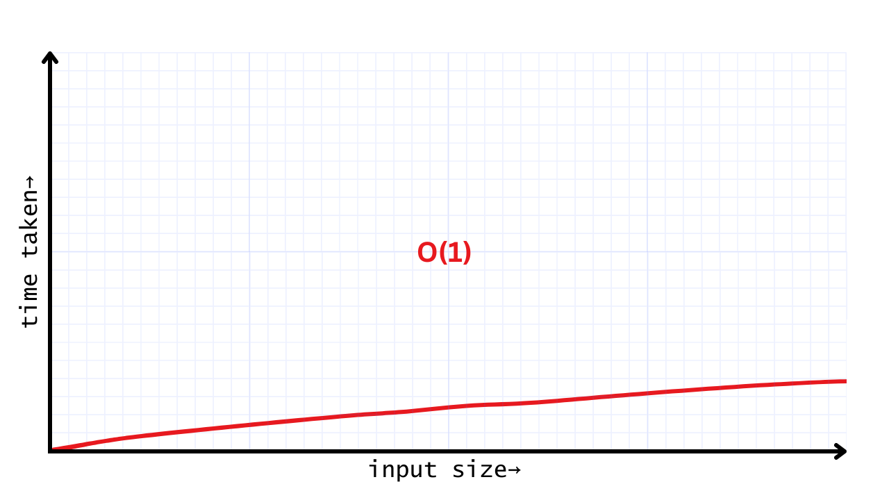
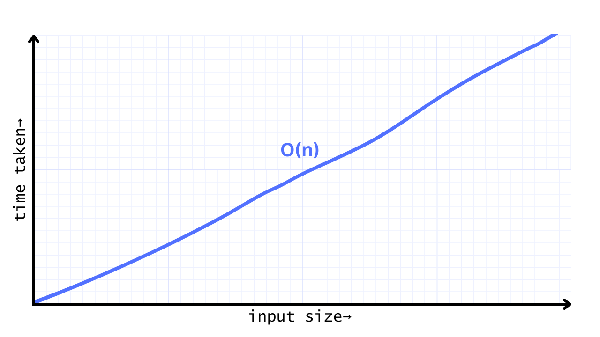
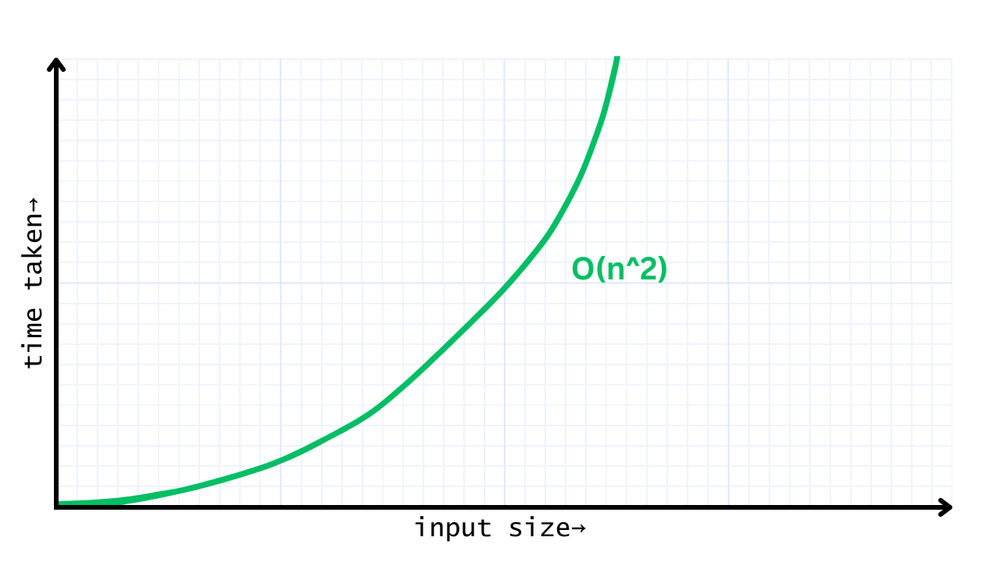
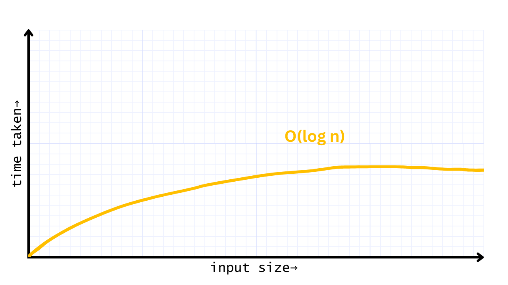
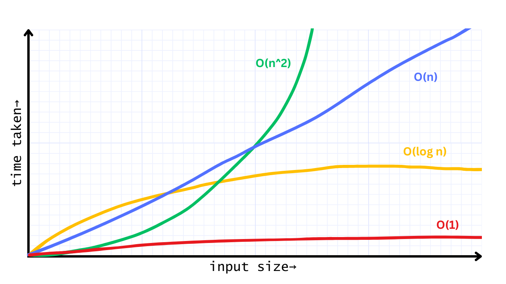

# Time Complexity

## Why Time Complexity?

In everyday life, we constantly compare similar things to make better decisions. For example, when shopping for potatoes, you might compare the prices:

- **30 Rs/Kg**
- **20 Rs/500g**

But how do we compare these?

First, we normalize the quantities to the same unit:

- **30 Rs for 1 Kg** or **30 Rs for 1000g**
- **20 Rs for 500g** or **40 Rs for 1000g**

Now, the comparison becomes straightforward. The first option is cheaper per kilogram.

Similarly, in computer science, we often need to compare two pieces of code to determine which one is more efficient. However, instead of cost and weight, we compare the performance of algorithms based on how much time it's taking to process the same amount of input data.

This brings us to the concept of **time complexity**.

## What is Time Complexity?

Imagine you are given two computers A and B. Both needs to perform common task.

**Task :** Print all the integers from 1 to 1000.

Now you simply write the code to fullfill the given task as below.

```python
import time

start_time = time.time()

for i in range(1, 1001):
    print(i)

end_time = time.time()
print(f"Time taken: {end_time - start_time} seconds")
```

and run the code in those two different computers.

**Outputs for A:**
```bash
...
999
1000
Time taken: 0.0006153583526611328 seconds
```
**Outputs for B:**
```bash
...
999
1000
Time taken: 0.0005153583526063514 seconds
```

From the results it's clear that B is a better computer than A ! Let's run again and verify that.

**Outputs for A:**
```bash
...
999
1000
Time taken: 0.0004982364822738292 seconds
```
**Outputs for B:**
```bash
...
999
1000
Time taken: 0.0005836583526742814 seconds
```

Wait what ? Now A took less time that B to run the same code, but why ?

The time taken to run the same code can vary even on the same machine due to factors like 
- background processes, 
- CPU load,
- memory usage. 

To consistently compare performance, we need a measure that is independent of specific hardware or environmental conditions—this is where **Time Complexity** becomes crucial. It only and only depends on the input size (`n`)

There are multiple notation to express **Time Complexity**, most popular one is **Big-O Notation**.

## Big-O Notation
In **Big-O Notation** we express time complexity with the below format
```text
O( <equation_in_terms_of_n> )

Example: O(n), O(n ^ 2) etc
```

where `n` stand for `input size`, and the equation says how the time taken is changing based on input size or `n`.

## Some of the most used notation

### 1. O(1)
Here time taken is not depended on size on input at all (`const time`).

**For example:**

```python
print("Hello world")
```
It takes almost same time to print `"Hello world"` and `"Hello Hello Hello world"`, proving that it doesn't depends on input size.

**Plot:**


> We get a little increase in the taken time as inpusize increases, however it's negligible.

### 2. O(n)
This is called **linear time complexity**. The time taken grows directly in proportion to the size of the input `n`. If you double the input size, the time taken also doubles.

**For example:**

```python
for i in range(n):
    print(i)
```

In this code, the `for` loop runs `n` times, so the time taken increases directly with `n`.

**Plot:**


> As we see in the plot, the time taken increases at a steady rate as the input size increases.

### 3. O(n^2)
This is known as **quadratic time complexity**. The time taken grows with the square of the input size. If you double the input size, the time taken becomes four times longer.

**For example:**

```python
for i in range(n):
    for j in range(n):
        print(i, j)
```

Here, two loops are nested, each running `n` times, leading to `n * n = n^2` operations, which is why it's called quadratic time complexity.

**Plot:**


> The plot shows a curved increase in time as the input size grows, which is why quadratic time can become slow for large inputs.

### 4. O(log n)
This is called **logarithmic time complexity**. The time taken increases slowly, even as the input size grows. It’s common in algorithms that repeatedly reduce the size of the problem with each step.

**For example:**

```python
n = 16
while n > 1:
    n = n // 2
    print(n)
```

In this code, `n` is divided by 2 repeatedly, so the number of steps is proportional to the logarithm of `n`.

**Plot:**


> The plot shows that the time taken increases very slowly, which is why logarithmic time complexity is efficient for large inputs.

### All Together


### Demo Comparison


From the above image we can clearly say that for `p1` size of data we would prefer `O(n)` algorithm over `O(lon n)` but for `p2` size of data, we would prefer the opposite.

In the next chapter we will learn how to calculate `Big-o` for a given code using basics mathematics.

**Happy Coding!**


